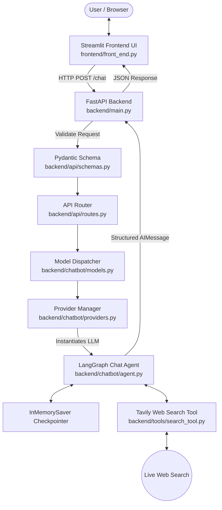

# CAA - Chat Agent Application 🤖🔍

A modular, full-stack AI Chat Agent Application built with **FastAPI**, **Streamlit**, **LangChain**, and **LangGraph**. CAA enables dynamic selection of multiple Large Language Model (LLM) providers (**Groq**, **Google Gemini**, and **Mistral AI**) combined with real-time web search capabilities powered by **Tavily AI** and stateful agent execution with short-term memory checkpointers.

---

## 🌟 Key Features

- **Multi-Provider LLM Integration**: Dynamically switch between top-tier AI providers and model architectures in real-time.
  - **Groq**: LLaMA 3.1 & 3.3 models, GPT-OSS variants.
  - **Google Gemini**: Gemini 3.6 Flash, 3.5 Flash, 3.5 Flash-Lite, 3.1 Flash-Lite.
  - **Mistral AI**: Mistral Large, Medium, and OCR models.
- **Real-Time Web Search Tooling**: Integrated with **Tavily Search API** (`TavilySearch`), enabling the AI agent to ground responses in fresh, up-to-date web information.
- **Agentic Workflows via LangGraph**: Uses LangGraph agent loop with `InMemorySaver` checkpointer for stateful message context tracking.
- **Custom System Prompting**: Full user control over agent personality, constraints, and instructions through the frontend UI.
- **Decoupled Architecture**:
  - **FastAPI REST API**: High-performance backend handling request validation, provider setup, tool binding, and agent execution.
  - **Streamlit Web Interface**: Lightweight, intuitive UI for model selection, prompt customization, and live conversation.
- **Strict Configuration Management**: Environment variables validated at runtime using `pydantic-settings`.

---

## 🏗️ Architecture & Workflow



---

## 📁 Directory Structure

```text
CAA-Chat-Agent-Application/
├── backend/
│   ├── api/
│   │   ├── routes.py          # FastAPI endpoint router (/chat)
│   │   └── schemas.py         # Pydantic request & response validation schemas
│   ├── chatbot/
│   │   ├── agent.py           # LangGraph agent creation & execution loop
│   │   ├── model_registry.py  # Central registry of providers & supported models
│   │   ├── models.py          # Core orchestration binding prompts, LLMs & agents
│   │   ├── prompts.py         # System prompt template definitions
│   │   └── providers.py       # Factory functions for Groq, Google, and Mistral LLMs
│   ├── config/
│   │   └── settings.py        # Centralized settings management via pydantic-settings
│   ├── tools/
│   │   └── search_tool.py     # Tavily search tool integration
│   └── main.py                # FastAPI application entry point (Port 9999)
├── frontend/
│   └── front_end.py           # Streamlit web application interface
├── .env                       # Environment configuration file (API Keys & Settings)
├── test_frontend.py           # Alternative/test Streamlit interface script
├── test_model.py              # Quick invocation test script for models
└── README.md                  # Project documentation
```

---

## 🛠️ Supported Providers & Models

| Provider | Model Name | Description / Use Case |
| :--- | :--- | :--- |
| **Groq** | `llama-3.3-70b-versatile` | High-capacity, ultra-fast inference |
| **Groq** | `llama-3.1-8b-instant` | Lightweight, low-latency execution |
| **Groq** | `openai/gpt-oss-120b` | Open-source large parameter model |
| **Groq** | `openai/gpt-oss-20b` | Efficient open-source model |
| **Google** | `gemini-3.6-flash` | Latest Google flagship flash model |
| **Google** | `gemini-3.5-flash` | Fast, general-purpose reasoning |
| **Google** | `gemini-3.5-flash-lite` | Resource-efficient Gemini model |
| **Google** | `gemini-3.1-flash-lite` | Lightweight legacy flash variant |
| **Mistral** | `mistral-large-latest` | Flagship reasoning and instruction-following |
| **Mistral** | `mistral-medium-latest` | Balanced intelligence and performance |
| **Mistral** | `mistral-ocr-latest` | Specialized document processing model |

---

## ⚙️ Prerequisites & Setup

### Prerequisites

- **Python**: Version 3.10 or higher
- API Keys for the providers you intend to use:
  - [Groq API Key](https://console.groq.com/)
  - [Google AI Studio API Key](https://aistudio.google.com/)
  - [Mistral AI Console Key](https://console.mistral.ai/)
  - [Tavily AI Search Key](https://tavily.com/)

---

### Installation Steps

1. **Clone the Repository**
   ```bash
   git clone <repository-url>
   cd CAA-Chat-Agent-Application
   ```

2. **Create & Activate Virtual Environment**
   ```bash
   # Windows (PowerShell)
   python -m venv .venv
   .venv\Scripts\Activate.ps1

   # Linux/macOS
   python3 -m venv .venv
   source .venv/bin/activate
   ```

3. **Install Required Packages**
   ```bash
   pip install -r requirements.txt

   ```

---

## 🔑 Environment Configuration

Create a `.env` file in the root directory of the project based on the following template:

```env
# Tavily Search API Key
TAVILY_API_KEY="your-tavily-api-key"

# Groq API Key & Default Model
GROQ_API_KEY="your-groq-api-key"
GROQ_MODEL_NAME="llama-3.3-70b-versatile"

# Google Gemini API Key & Default Model
GEMINI_API_KEY="your-gemini-api-key"
GEMINI_MODEL_NAME="gemini-3.6-flash"

# Mistral AI API Key & Default Model
MISTRAL_API_KEY="your-mistral-api-key"
MISTRAL_MODEL_NAME="mistral-large-latest"

# Model Hyperparameters
TEMPERATURE=0.7
```

---

## 🚀 Running the Application

### 1. Launch the Backend Server

Start the FastAPI server on port `9999`:

```bash
python backend/main.py
```
*Or using uvicorn directly:*
```bash
uvicorn backend.main:app --host 127.0.0.1 --port 9999 --reload
```

The backend server will run at: `http://127.0.0.1:9999`
Interactive API Documentation (Swagger UI) is available at: `http://127.0.0.1:9999/docs`

---

### 2. Launch the Frontend Interface

In a separate terminal window (with the virtual environment activated), start Streamlit:

```bash
python -m streamlit run frontend/front_end.py
```

The Streamlit interface will automatically open in your default browser at `http://localhost:8501`.

---

## 📡 API Reference

### `POST /chat`

Sends a query to the specified LLM provider and model with a custom system prompt.

#### Request Body Schema (`RequestState`)

```json
{
  "provider": "Groq",
  "model": "llama-3.3-70b-versatile",
  "system_prompt": "You are a helpful research assistant.",
  "messages": [
    "What are the latest developments in quantum computing in 2026?"
  ]
}
```

#### Example `curl` Request

```bash
curl -X POST "http://127.0.0.1:9999/chat" \
     -H "Content-Type: application/json" \
     -d '{
           "provider": "Google",
           "model": "gemini-3.6-flash",
           "system_prompt": "You are a tech news summarizer.",
           "messages": ["Summarize recent AI news"]
         }'
```

#### Example Response

```json
"Based on recent updates, here are the top developments in AI..."
```

---

## 🧪 Testing

To verify provider configurations or run backend/frontend tests independently:

- **Test LLM Provider directly**:
  ```bash
  python test_model.py
  ```
- **Test Streamlit UI alternative configuration**:
  ```bash
  streamlit run test_frontend.py
  ```

---

## 🤝 Contributing

Contributions, issues, and feature requests are welcome! Feel free to check the issues page or submit pull requests to enhance model integrations, add search tools, or refine UI components.

---

## 📜 License

This project is open-source and available under the [MIT License](LICENSE).
